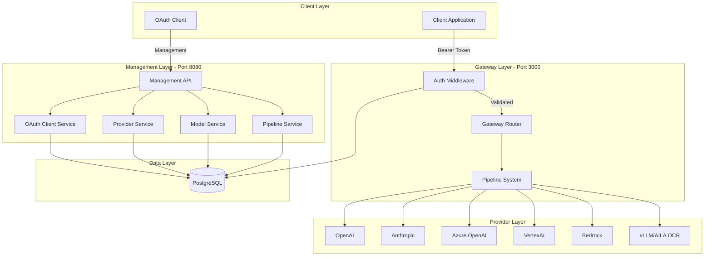
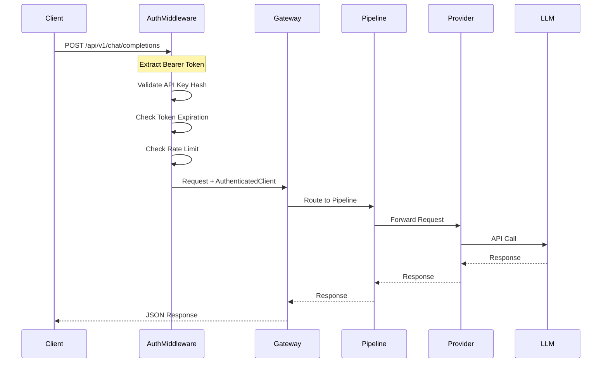
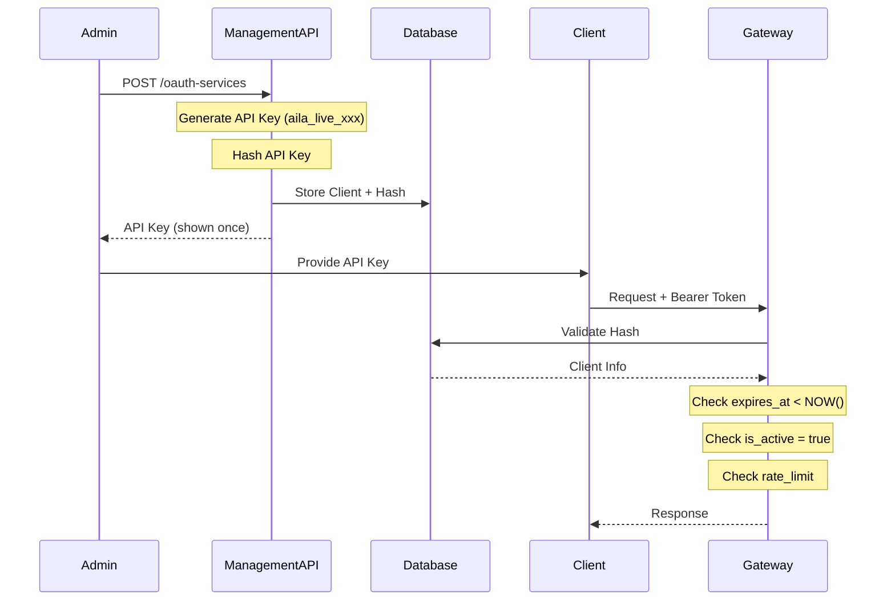
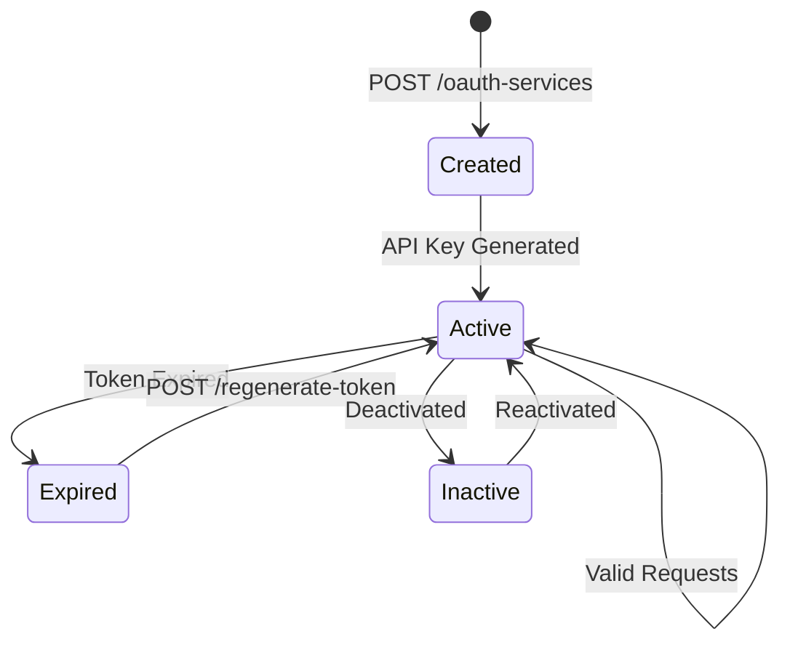
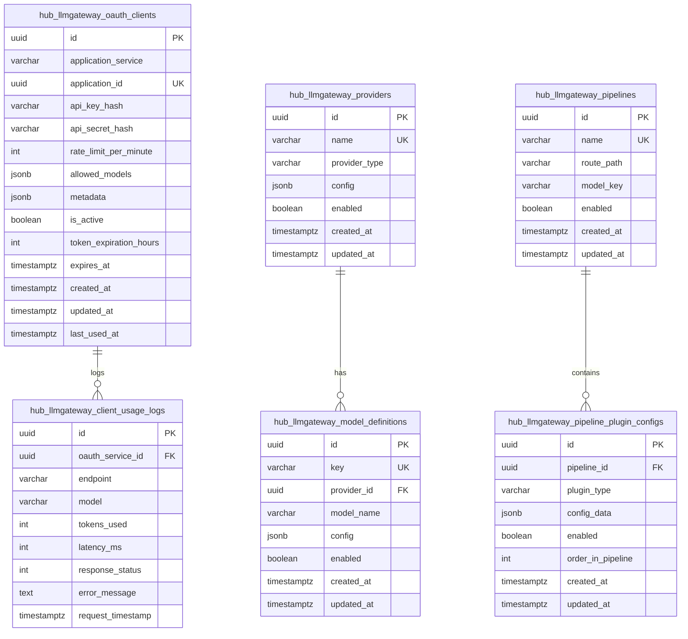
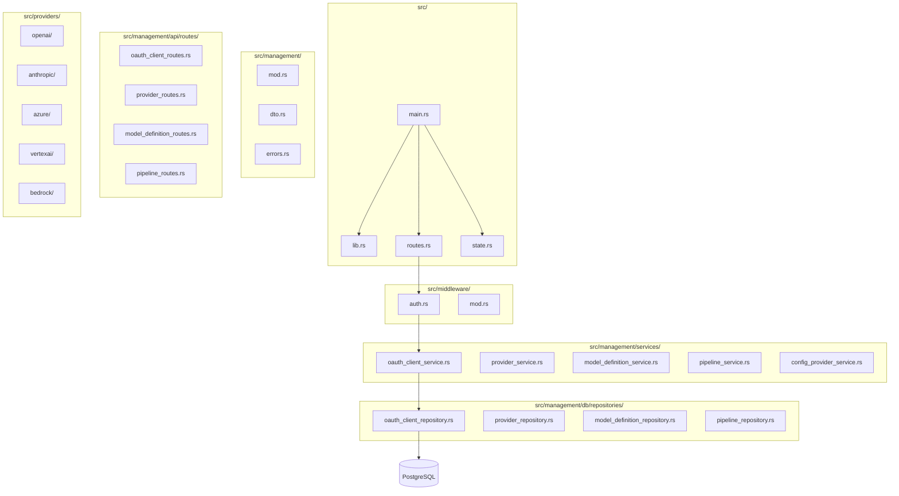
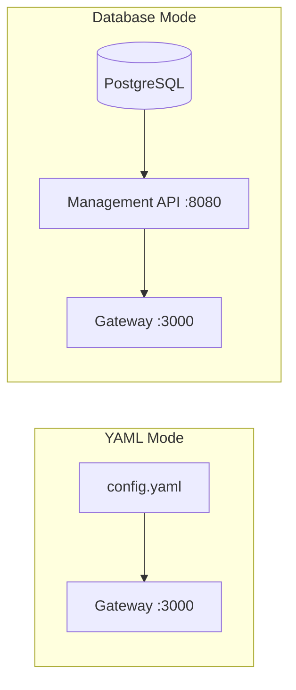
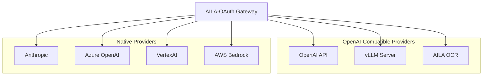
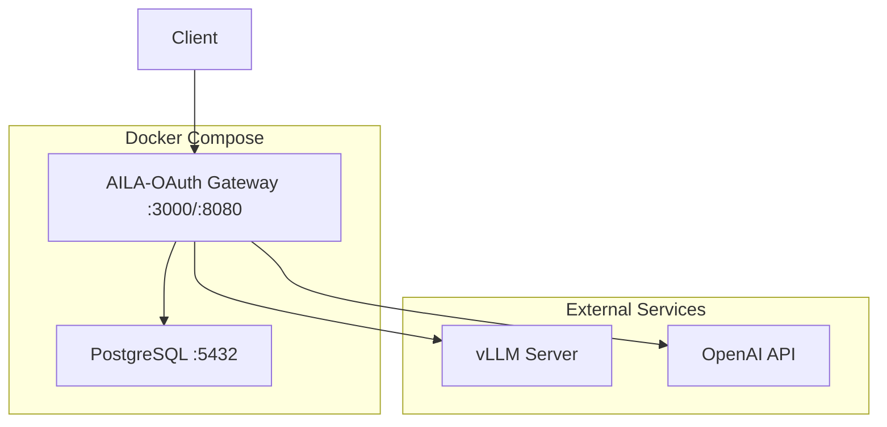

# AILA-OAuth Architecture

## System Overview

The AILA-OAuth Gateway is a high-performance LLM proxy written in Rust that provides unified access to multiple LLM providers with built-in OAuth client authentication, rate limiting, and usage tracking.

**Key Components:**
- **Client Layer**: Applications that consume the LLM API using OAuth tokens
- **Gateway Layer (Port 3000)**: Handles authentication, routing, and request processing
- **Management Layer (Port 8080)**: REST API for configuration management
- **Data Layer**: PostgreSQL database for persistent storage
- **Provider Layer**: Supported LLM backends (OpenAI, Anthropic, Azure, vLLM/AILA OCR)

## Why OAuth Authentication Layer?

### Architectural Reasoning

The OAuth authentication layer serves as a **critical security and governance boundary** between client applications and backend LLM providers. This separation of concerns provides multiple architectural benefits:

#### 1. **Security Isolation**
- **Problem**: Exposing provider API keys directly to client applications creates security risks
- **Solution**: OAuth layer acts as a proxy - clients never see provider credentials
- **Benefit**: Provider API keys (e.g., vLLM HuggingFace token) remain secure on the gateway

#### 2. **Multi-Tenancy & Client Management**
- **Problem**: Multiple applications need access to the same LLM providers
- **Solution**: Each client gets unique OAuth credentials (`aila_live_xxx`) with individual:
  - Rate limits (`rate_limit_per_minute`)
  - Allowed models (`allowed_models` JSONB array)
  - Token expiration (`token_expiration_hours`)
  - Usage tracking and audit logs
- **Benefit**: Granular control per application without modifying provider configurations

#### 3. **Provider Abstraction**
- **Problem**: Different providers use different authentication mechanisms
- **Solution**: OAuth layer provides unified authentication interface
- **Benefit**: Clients use one token format regardless of backend provider (OpenAI, vLLM, Anthropic, etc.)

#### 4. **Request Flow Separation**

```
Client Request → OAuth Validation → Model Routing → Provider Authentication → LLM Backend
     ↓                  ↓                  ↓                    ↓                  ↓
Bearer Token    Hash Validation    Model Key Lookup    Provider API Key    Actual Model
aila_live_xxx    (Database)         aila-ocr → model    HF Token           allenai/olmOCR
```

**Critical Distinction:**
- **OAuth Token** (`aila_live_xxx`): Authenticates the **client application** to access the gateway
- **Provider API Key** (e.g., HuggingFace token): Authenticates the **gateway** to access the LLM provider
- **Model Key** (`aila-ocr`): Routes request to correct model definition in pipeline
- **Model Type** (`allenai/olmOCR-2-7B-1025-FP8`): Actual model name sent to provider

#### 5. **Rate Limiting & Cost Control**
- **Problem**: Uncontrolled LLM usage can lead to cost overruns
- **Solution**: Per-client rate limits enforced at OAuth layer
- **Implementation**: Database-backed counter checks requests per minute
- **Benefit**: Prevent abuse and control costs per application

#### 6. **Usage Tracking & Auditing**
- **Problem**: Need visibility into which applications use which models
- **Solution**: `hub_llmgateway_client_usage_logs` table tracks every request
- **Data Captured**:
  - `oauth_service_id`: Which client made the request
  - `endpoint`: Which API endpoint was called
  - `model`: Which model was used
  - `tokens_used`: Token consumption
  - `latency_ms`: Response time
  - `response_status`: Success/failure
  - `request_timestamp`: When request occurred
- **Benefit**: Complete audit trail for billing, debugging, and optimization

#### 7. **Dynamic Configuration Without Downtime**
- **Problem**: Changing provider credentials requires application restart
- **Solution**: OAuth clients and provider configs stored in database
- **Benefit**: Update provider API keys, add new clients, modify rate limits without gateway restart



## Complete Request Flow with OAuth Layer

The request flow illustrates how an authenticated client request travels through the gateway to reach the LLM provider. Each step performs validation and transformation before forwarding the request.

### Detailed Processing Steps

#### Step 1: Client Request

**Text Request:**
```json
POST http://localhost:3000/api/v1/chat/completions
Authorization: Bearer aila_live_xxx
Content-Type: application/json

{
  "model": "aila-ocr",
  "messages": [{"role": "user", "content": "Extract text"}],
  "max_tokens": 1024,
  "temperature": 0.7,
  "top_p": 0.9,
  "top_k": 50
}
```

**Vision Request (Multi-Modal):**
```json
POST http://localhost:3000/api/v1/chat/completions
Authorization: Bearer aila_live_xxx
Content-Type: application/json

{
  "model": "aila-ocr",
  "messages": [{
    "role": "user",
    "content": [
      {"type": "text", "text": "Extract ID information"},
      {"type": "image_url", "image_url": {"url": "data:image/jpeg;base64,..."}}
    ]
  }],
  "max_tokens": 1000,
  "temperature": 0.7,
  "top_p": 0.9,
  "top_k": 50
}
```


#### Step 2: LLM Provider Request
```json
POST http://vllm-inference/v1/chat/completions
Authorization: Bearer YOUR_HF_TOKEN
Content-Type: application/json

{
  "model": "allenai/olmOCR-2-7B-1025-FP8",
  "messages": [{"role": "user", "content": "Extract text from image"}],
  "max_tokens": 1024,
  "temperature": 0.7,
  "top_p": 0.9,
  "top_k": 50
}
```

#### Step 3: Response Flow
- vLLM → Provider → Pipeline → Gateway → Client
- Usage logged to `hub_llmgateway_client_usage_logs`
- `last_used_at` updated in `hub_llmgateway_oauth_clients`

### Key Architectural Insights

**Two-Layer Authentication:**
1. **Client → Gateway**: OAuth token (`aila_live_xxx`) validates client application
2. **Gateway → Provider**: Provider API key (e.g., HuggingFace token) authenticates gateway

**Model Name Translation:**
- Client sends: `"model": "aila-ocr"` (friendly key)
- Gateway resolves: `aila-ocr` → `allenai/olmOCR-2-7B-1025-FP8`
- Provider receives: `"model": "allenai/olmOCR-2-7B-1025-FP8"` (actual model)
- Response returns: `"model": "aila-ocr"` (preserves requested key)

**Why This Design?**
- **Abstraction**: Clients don't need to know actual model names
- **Flexibility**: Change backend model without updating clients
- **Security**: Provider credentials never exposed to clients
- **Control**: Enforce which models each client can access



## OAuth Authentication Flow

The OAuth flow implements a secure client authentication system with configurable token expiration and automatic regeneration capability.

**Security Features:**
- **Token Format**: `aila_live_<32_random_chars>` - easily identifiable prefix
- **Configurable Expiration**: Token expiration is configurable via `token_expiration_hours` (default: 24h)
- **Token Regeneration**: Clients can regenerate expired tokens via API
- **Application ID**: Auto-generated unique identifier (`app_<16_chars>`) for each application
- **Client Lookup**: Check if client exists by application_service or application_id
- **Rate Limiting**: Per-client configurable request limits
- **Usage Logging**: All requests are logged for auditing



## Token Expiration Flow



## Database Schema



## Module Structure



## Configuration Modes



## Provider Integration



## Deployment Architecture



## Gateway API Service

The AILA-OAuth Gateway provides an OpenAI-compatible REST API for LLM inference.

### Core Endpoints (Port 3000)

| Endpoint | Method | Description |
|----------|--------|-------------|
| `/api/v1/chat/completions` | POST | Chat completions (streaming supported) |
| `/api/v1/completions` | POST | Text completions |
| `/api/v1/embeddings` | POST | Text embeddings |
| `/health` | GET | Health check |
| `/metrics` | GET | Prometheus metrics |

### Management Endpoints (Port 8080)

| Endpoint | Method | Description |
|----------|--------|-------------|
| `/api/v1/management/oauth-services` | CRUD | OAuth client management |
| `/api/v1/management/providers` | CRUD | Provider configuration |
| `/api/v1/management/model-definitions` | CRUD | Model definitions |
| `/api/v1/management/pipelines` | CRUD | Pipeline configuration |

### Request Processing Flow

1. **Auth Middleware**: Validates Bearer token, checks token expiration
2. **Rate Limiter**: Enforces per-client request limits
3. **Pipeline Router**: Routes to configured pipeline
4. **Model Router**: Selects target model
5. **Provider**: Forwards to LLM backend (vLLM, OpenAI, etc.)

### Authentication

- Bearer token format: `aila_live_<random_string>`
- Token expiration: Configurable via `token_expiration_hours` (default: 24h)
- Regeneration: `POST /oauth-services/{id}/regenerate-token`

## Key Features

| Feature | Description |
|---------|-------------|
| Multi-Provider Support | OpenAI, Anthropic, Azure, VertexAI, Bedrock, vLLM |
| Multi-Modal Vision API | Text + image support for VLMs |
| Full Parameter Support | top_k, top_p, seed, repetition_penalty, etc. |
| OAuth Authentication | Configurable token expiration with regeneration |
| Rate Limiting | Per-client configurable limits |
| Usage Logging | Track requests per client |
| Hot Reload | Dynamic configuration updates |
| OpenAI Compatible | Drop-in replacement for OpenAI API |

## Environment Variables

| Variable | Description | Default |
|----------|-------------|---------|
| AILA_OAUTH_MODE | yaml or database | yaml |
| DATABASE_URL | PostgreSQL connection | - |
| REQUIRE_AUTH | Enable OAuth | false |
| PORT | Gateway port | 3000 |
| MANAGEMENT_PORT | Management API port | 8080 |
| RUST_LOG | Log level | warn |

## Security Features

| Feature | Implementation |
|---------|----------------|
| API Key Hashing | Double hash with DefaultHasher |
| Token Expiration | Configurable via API (default: 24 hours) |
| Rate Limiting | Database-backed counter |
| Secret Masking | API keys masked in responses |
| Client Deactivation | is_active flag |
